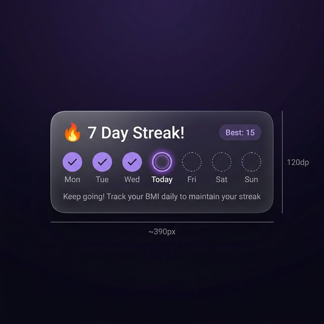
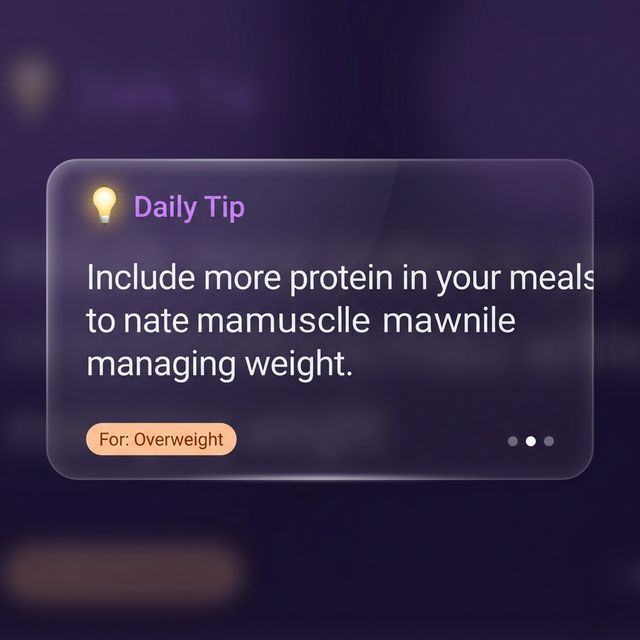
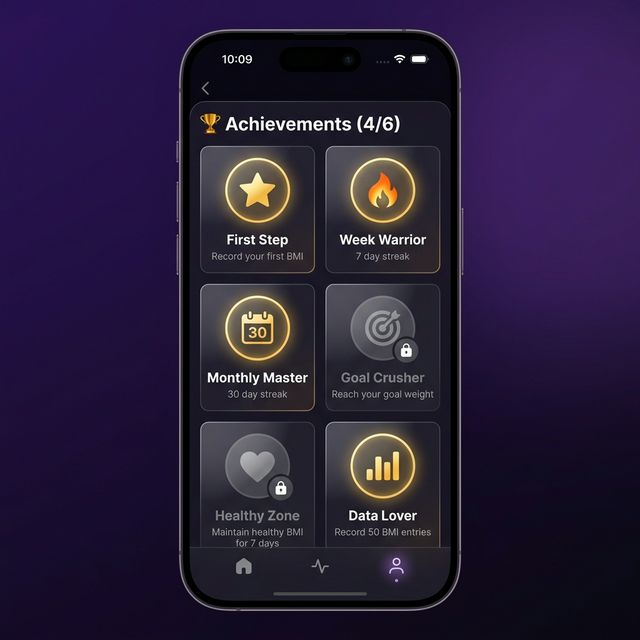

# 🎮 Gamification Features — Implementation Plan

> **Mục tiêu**: Tăng Daily Active Users bằng 3 tính năng gamification  
> **Ngôn ngữ**: EN, VI, DE, FR, JA, KO, TH  
> **Code rules**: Nullable (không dùng `lateinit`), no memory leak, light/dark mode

---

## 1. 🔥 Streak Counter

### Mockup


### UI/UX
- **Vị trí**: Card nằm trên cùng Main screen, phía trên body sliders (trong `NestedScrollView`)
- **Layout**: `item_streak_card.xml` + variant `layout-night`
  - Row 1: 🔥 icon + "X Day Streak!" (bold 20sp) + pill badge "Best: Y"
  - Row 2: 7 circle indicators (Mon→Sun), checked ✓ = filled purple, today = glowing ring, future = dotted
  - Row 3: motivational text (gray 12sp)
- **Dark/Light**: `@color/textColor`, glass backgrounds (đã có cả 2 variants)

### ❓ Edge Cases

| Câu hỏi | Trả lời |
|---------|---------|
| Miss streak? | Reset về **1** (không phải 0). `best_streak` không bao giờ reset |
| Mở app 4 lần/ngày? | Streak chỉ **+1 tối đa/ngày**. Check theo `yyyy-MM-dd`, nếu `lastDate == today` → bỏ qua |
| Xóa app cài lại? | **Mất streak** (SharedPrefs bị xóa). Future: có thể lưu vào Room DB |
| 400 ngày liên tiếp? | Streak = **400 chính xác**. Int max = 2.1 tỷ → không overflow |

### Logic — `StreakManager.kt`

```kotlin
object StreakManager {
    private const val PREFS = "streak_prefs"
    private const val KEY_CURRENT = "current_streak"
    private const val KEY_BEST = "best_streak"
    private const val KEY_LAST = "last_check_date"

    fun recordCheck(context: Context) {
        val prefs = context.getSharedPreferences(PREFS, Context.MODE_PRIVATE)
        val today = LocalDate.now().toString()
        val lastDate = prefs.getString(KEY_LAST, null)

        if (lastDate == today) return                   // Chỉ +1/ngày

        val yesterday = LocalDate.now().minusDays(1).toString()
        val current = prefs.getInt(KEY_CURRENT, 0)
        val newStreak = if (lastDate == yesterday) current + 1 else 1
        val best = maxOf(newStreak, prefs.getInt(KEY_BEST, 0))

        prefs.edit()
            .putInt(KEY_CURRENT, newStreak)
            .putInt(KEY_BEST, best)
            .putString(KEY_LAST, today)
            .apply()
    }

    fun getStreakData(context: Context): StreakData { ... }
}
data class StreakData(val current: Int, val best: Int, val lastDate: String?)
```

### Files

| Action | File | Mô tả |
|--------|------|-------|
| NEW | `StreakManager.kt` | Singleton streak logic + SharedPrefs |
| NEW | `res/layout/item_streak_card.xml` | Light mode card |
| NEW | `res/layout-night/item_streak_card.xml` | Dark mode card |
| MODIFY | `a_main.xml` + `layout-night/a_main.xml` | Include streak card |
| MODIFY | `MainAct.kt` | `onResume()` → update streak UI |
| MODIFY | `ResultAct.kt` | `saveToHistory()` → `StreakManager.recordCheck()` |
| MODIFY | 7 × `strings.xml` | 4 strings |

### Strings

| Key | EN | VI |
|-----|----|----|
| `streak_title` | %d Day Streak! | %d Ngày Liên Tiếp! |
| `streak_best` | Best: %d | Kỷ lục: %d |
| `streak_motivation` | Keep going! Track your BMI daily | Tiếp tục nào! Theo dõi BMI mỗi ngày |
| `streak_start` | Start your streak today! | Bắt đầu chuỗi ngày hôm nay! |

*(DE, FR, JA, KO, TH dịch tương tự)*

---

## 2. 💡 Health Tips

### Mockup


### UI/UX
- **Vị trí**: Card trên **Result screen**, dưới BMI result, trên Goal Weight card
- **Layout**: `item_health_tip.xml` + ViewPager2 container
  - Label: "💡 Daily Tip" (purple accent)
  - Content: Tip text (white 15sp)
  - Bottom-left: BMI category pill "For: Overweight" (color theo category)
  - Bottom-right: Page indicator dots (3 dots)
- **Auto-rotate**: `Handler.postDelayed` mỗi 5s (cancel trong `onPause()`)
- **Dark/Light**: Theme colors + glass background

### Data source & Multi-language

- **50 tips / ngôn ngữ** — hardcoded trong `<string-array>` (không cần API)
- **7 ngôn ngữ × 50 tips = 350 strings** tổng cộng
- ~8KB/ngôn ngữ × 7 = ~56KB — không đáng kể
- Android tự chọn đúng locale
- User dùng app **~2 tháng** mới thấy tip lặp lại

### Phân bổ 50 tips

| Category | BMI | Số tips |
|----------|-----|---------|
| 🔵 Underweight | < 18.5 | 10 |
| 🟢 Healthy | 18.5–25 | 15 |
| 🟡 Overweight | 25–30 | 15 |
| 🔴 Obese | ≥ 30 | 10 |
| **Tổng** | | **50** |

### Logic chọn tip
```
1. Lấy BMI category → đúng string-array
2. tip_index = dayOfYear % array.size → tip chính
3. ViewPager2 hiện 3 tips: index, index+1, index+2 (wrap)
4. Mỗi ngày tips khác nhau tự động
```

### 🔵 Underweight Tips (10)

| # | EN |
|---|----|
| 1 | Eat calorie-dense foods like nuts, avocados, and whole grains |
| 2 | Try having 5-6 smaller meals throughout the day instead of 3 large ones |
| 3 | Include protein-rich foods like eggs, fish, and legumes in every meal |
| 4 | Strength training can help build healthy muscle mass |
| 5 | Track your daily calorie intake to ensure you're eating enough |
| 6 | Add healthy fats like olive oil, cheese, and nut butters to your meals |
| 7 | Drink smoothies and shakes as calorie-rich snacks between meals |
| 8 | Avoid drinking water before meals — it can reduce appetite |
| 9 | Choose nutrient-dense snacks like trail mix, yogurt, and dried fruits |
| 10 | Get adequate sleep — poor sleep can affect appetite and metabolism |

### 🟢 Healthy Tips (15)

| # | EN |
|---|----|
| 1 | Maintain a balanced diet with plenty of fruits and vegetables |
| 2 | Stay active with at least 150 minutes of moderate exercise per week |
| 3 | Drink at least 8 glasses of water daily to stay hydrated |
| 4 | Get 7-9 hours of quality sleep every night |
| 5 | Regular health checkups help catch problems early |
| 6 | Practice mindful eating — pay attention to hunger and fullness cues |
| 7 | Limit processed foods and choose whole, natural alternatives |
| 8 | Manage stress through meditation, yoga, or deep breathing exercises |
| 9 | Include a variety of food groups in every meal for balanced nutrition |
| 10 | Take short walking breaks if you sit for long periods during the day |
| 11 | Limit added sugar intake to less than 25g per day |
| 12 | Eat more fiber-rich foods like oats, beans, and whole wheat bread |
| 13 | Cook more meals at home to control ingredients and portions |
| 14 | Stay socially active — strong social connections improve overall health |
| 15 | Protect your skin with sunscreen and stay safe in the sun |

### 🟡 Overweight Tips (15)

| # | EN |
|---|----|
| 1 | Reduce portion sizes gradually — use smaller plates as a visual trick |
| 2 | Include more fiber-rich foods to help you feel full longer |
| 3 | Start with 30 minutes of walking daily and gradually increase |
| 4 | Replace sugary drinks with water, herbal tea, or infused water |
| 5 | Keep a food journal to become aware of your eating patterns |
| 6 | Eat slowly and chew thoroughly — it takes 20 minutes to feel full |
| 7 | Plan your meals ahead to avoid impulsive unhealthy choices |
| 8 | Choose lean proteins like chicken breast, fish, and tofu |
| 9 | Avoid eating late at night — try to finish dinner 3 hours before bed |
| 10 | Find physical activities you enjoy — dancing, swimming, or cycling |
| 11 | Cut back on refined carbs like white bread, pasta, and pastries |
| 12 | Get a workout buddy — social support increases motivation |
| 13 | Read nutrition labels to make informed food choices |
| 14 | Replace elevator rides with stairs whenever possible |
| 15 | Celebrate small victories — every 0.5 kg lost is progress |

### 🔴 Obese Tips (10)

| # | EN |
|---|----|
| 1 | Consult a healthcare professional for personalized guidance |
| 2 | Start with gentle exercises like walking or water aerobics |
| 3 | Focus on whole foods and avoid highly processed foods |
| 4 | Set realistic goals — aim for 0.5 to 1 kg per week |
| 5 | Consider working with a registered nutritionist |
| 6 | Track your progress regularly — small changes add up over time |
| 7 | Build a support system of family and friends for encouragement |
| 8 | Prioritize sleep — poor sleep increases hunger hormones |
| 9 | Practice portion control: half vegetables, quarter protein, quarter grains |
| 10 | Focus on building healthy habits rather than quick-fix diets |

### Files

| Action | File | Mô tả |
|--------|------|-------|
| NEW | `res/layout/item_health_tip.xml` | Tip card layout |
| NEW | `HealthTipAdapter.kt` | ViewPager2 adapter |
| MODIFY | `a_result.xml` | Thêm ViewPager2 + dots |
| MODIFY | `ResultAct.kt` | Setup ViewPager2, auto-scroll, tips theo BMI |
| MODIFY | 7 × `strings.xml` | 4 `<string-array>` (50 tips) + labels |

---

## 3. 🏆 Achievement Badges

### Mockup


### UI/UX
- **Touch point**: Menu dialog → "🏆 Achievements" (cạnh History, Tracker)
- **Component**: `AchievementsBottomSheet.kt` — `BottomSheetDialogFragment`
- **Layout**: `fragment_achievements.xml`
  - Header: "🏆 Achievements (X/Y)" bold 20sp + close button
  - Grid: RecyclerView `GridLayoutManager(spanCount=2)`
  - Mỗi badge: glass card `item_badge.xml`

### Mỗi Badge Card

```
┌──────────────────────────┐
│     [Icon 40dp]          │  ← golden nếu earned / gray+lock nếu locked
│   Badge Name (bold 14sp) │  ← white nếu earned / gray nếu locked
│   Description (12sp)     │  ← luôn gray
│   ✅ Earned: 19/03/2026  │  ← chỉ hiện nếu earned
└──────────────────────────┘
```

### 6 Badges chi tiết

#### ⭐ Badge 1: First Step
| | |
|-|-|
| **ID** | `first_step` |
| **Icon** | `ic_badge_star.xml` |
| **Điều kiện** | `getRecordCount(profileId) >= 1` |
| **Check khi** | `saveToHistory()` |
| **Mô tả** | Dễ nhất — unlock ngay lần đầu tính BMI |

#### 🔥 Badge 2: Week Warrior
| | |
|-|-|
| **ID** | `week_warrior` |
| **Icon** | `ic_badge_fire.xml` |
| **Điều kiện** | `StreakManager.best >= 7` |
| **Check khi** | `StreakManager.recordCheck()` |
| **Phụ thuộc** | Phase 1 (Streak) |

#### 📅 Badge 3: Monthly Master
| | |
|-|-|
| **ID** | `monthly_master` |
| **Icon** | `ic_badge_calendar.xml` |
| **Điều kiện** | `StreakManager.best >= 30` |
| **Check khi** | `StreakManager.recordCheck()` |
| **Phụ thuộc** | Phase 1 (Streak) |

#### 🎯 Badge 4: Goal Crusher
| | |
|-|-|
| **ID** | `goal_crusher` |
| **Icon** | `ic_badge_target.xml` |
| **Điều kiện** | `goalWeight != null && currentWeight <= goalWeight` |
| **Check khi** | `saveToHistory()` nếu đã set goal |
| **Phụ thuộc** | Goal Weight feature (đã có) |

#### ❤️ Badge 5: Healthy Zone
| | |
|-|-|
| **ID** | `healthy_zone` |
| **Icon** | `ic_badge_heart.xml` |
| **Điều kiện** | 7 BMI records gần nhất đều trong 18.5–25.0 |
| **Check khi** | `saveToHistory()` |
| **Query** | `getRecentRecords(profileId, 7)` → all `.bmi in 18.5..25.0` |

#### 📊 Badge 6: Data Lover
| | |
|-|-|
| **ID** | `data_lover` |
| **Icon** | `ic_badge_chart.xml` |
| **Điều kiện** | `getRecordCount(profileId) >= 50` |
| **Check khi** | `saveToHistory()` |
| **Mô tả** | Long-term engagement badge |

### Logic — `BadgeManager.kt`

```kotlin
object BadgeManager {
    private const val PREFS = "badge_prefs"

    enum class Badge(val id: String, val titleRes: Int, val descRes: Int, val iconRes: Int) {
        FIRST_STEP("first_step", R.string.badge_first_step, ...),
        WEEK_WARRIOR("week_warrior", ...),
        // ...
    }

    // Trả về list badges MỚI unlock (để hiện celebration)
    fun checkAll(ctx: Context, recordCount: Int, bmi: Double,
                 weight: Double, goal: Double?, recentBmiList: List<Double>): List<Badge> {
        val new = mutableListOf<Badge>()
        fun tryUnlock(b: Badge, ok: Boolean) {
            val prefs = ctx.getSharedPreferences(PREFS, Context.MODE_PRIVATE)
            if (!prefs.getBoolean("${b.id}_earned", false) && ok) {
                prefs.edit().putBoolean("${b.id}_earned", true)
                    .putLong("${b.id}_date", System.currentTimeMillis()).apply()
                new.add(b)
            }
        }
        tryUnlock(Badge.FIRST_STEP, recordCount >= 1)
        tryUnlock(Badge.DATA_LOVER, recordCount >= 50)
        tryUnlock(Badge.WEEK_WARRIOR, StreakManager.getStreakData(ctx).best >= 7)
        tryUnlock(Badge.MONTHLY_MASTER, StreakManager.getStreakData(ctx).best >= 30)
        if (goal != null && goal > 0) tryUnlock(Badge.GOAL_CRUSHER, weight <= goal)
        if (recentBmiList.size >= 7)
            tryUnlock(Badge.HEALTHY_ZONE, recentBmiList.takeLast(7).all { it in 18.5..25.0 })
        return new
    }
}
```

### Celebration khi unlock

```kotlin
// Trong ResultAct.saveToHistory():
newlyEarned.forEach { badge ->
    Snackbar.make(binding.root, "🎉 ${getString(badge.titleRes)}!", Snackbar.LENGTH_LONG)
        .setBackgroundTint(ContextCompat.getColor(this, R.color.bmi_healthy)).show()
}
```

### Files

| Action | File | Mô tả |
|--------|------|-------|
| NEW | `BadgeManager.kt` | Badge logic + SharedPrefs |
| NEW | `AchievementsBottomSheet.kt` | BottomSheet grid |
| NEW | `BadgeAdapter.kt` | Grid adapter |
| NEW | `res/layout/fragment_achievements.xml` | BottomSheet layout |
| NEW | `res/layout/item_badge.xml` | 1 badge card |
| NEW | 6 × `ic_badge_*.xml` | Vector icons |
| MODIFY | `BmiDao.kt` | `@Query getRecordCount(profileId)` |
| MODIFY | `dialog_menu.xml` (2 variants) | menuAchievements |
| MODIFY | `MainAct.kt` | Handler menuAchievements |
| MODIFY | `ResultAct.kt` | `BadgeManager.checkAll()` + Snackbar |
| MODIFY | 7 × `strings.xml` | 14 strings (6 tên + 6 mô tả + 2 labels) |

### Strings

| Key | EN | VI |
|-----|----|----|
| `badge_first_step` | First Step | Bước Đầu Tiên |
| `badge_first_step_desc` | Record your first BMI | Ghi lại BMI đầu tiên |
| `badge_week_warrior` | Week Warrior | Chiến Binh Tuần |
| `badge_week_warrior_desc` | Maintain a 7-day streak | Duy trì chuỗi 7 ngày |
| `badge_monthly_master` | Monthly Master | Bậc Thầy Tháng |
| `badge_monthly_master_desc` | Maintain a 30-day streak | Duy trì chuỗi 30 ngày |
| `badge_goal_crusher` | Goal Crusher | Chinh Phục Mục Tiêu |
| `badge_goal_crusher_desc` | Reach your goal weight | Đạt cân nặng mục tiêu |
| `badge_healthy_zone` | Healthy Zone | Vùng Khoẻ Mạnh |
| `badge_healthy_zone_desc` | Stay in healthy BMI for 7 entries | BMI khoẻ mạnh 7 lần liên tiếp |
| `badge_data_lover` | Data Lover | Người Yêu Dữ Liệu |
| `badge_data_lover_desc` | Record 50 BMI entries | Ghi lại 50 lần BMI |
| `badge_unlocked` | 🎉 Achievement Unlocked! | 🎉 Mở khóa thành tựu! |
| `achievements_title` | Achievements (%d/%d) | Thành tựu (%d/%d) |

*(DE, FR, JA, KO, TH dịch tương tự)*

---

## 📋 Thứ tự triển khai

```
Phase 1: StreakManager + Streak Card        (~15 files, độc lập)
   ↓
Phase 2: Health Tips 50 tips × 7 langs      (~10 files, độc lập)
   ↓
Phase 3: BadgeManager + Achievements        (~20 files, phụ thuộc Phase 1)
```

## ✅ Implementation Status: COMPLETE

Build: `./gradlew compileDevDebugKotlin` → **0 errors** ✅

---

## 🧪 Hướng Dẫn Test Chi Tiết

### Test 1: 🔥 Streak Counter

| Bước | Hành động | Kết quả mong đợi |
|------|-----------|-------------------|
| 1 | Mở app lần đầu (chưa tính BMI) | Streak card: "Start your streak today!" |
| 2 | Tính BMI → Back về Main | "🔥 1 Day Streak!", Best: 1 |
| 3 | Tính BMI lại cùng ngày | Vẫn "1 Day Streak!" (KHÔNG +1) |
| 4 | Tính BMI ngày hôm sau | "🔥 2 Day Streak!" |
| 5 | Miss 1 ngày → tính BMI | "🔥 1 Day Streak!", Best giữ kỷ lục cũ |

### Test 2: 💡 Health Tips

| Bước | Hành động | Kết quả mong đợi |
|------|-----------|-------------------|
| 1 | Tính BMI → Result screen | Tip card "💡 Daily Tip" dưới BMI result |
| 2 | Swipe tip card | 3 tips, dot indicator di chuyển |
| 3 | Đợi 5 giây | Tip auto-scroll |
| 4 | BMI < 18.5 | Tips underweight |
| 5 | BMI 18.5-25 | Tips healthy |
| 6 | BMI 25-30 | Tips overweight |
| 7 | BMI ≥ 30 | Tips obese |

### Test 3: 🏆 Achievement Badges

| Bước | Hành động | Kết quả mong đợi |
|------|-----------|-------------------|
| 1 | Tính BMI lần đầu | Snackbar "🎉 First Step!" |
| 2 | Menu → Achievements | Grid 6 badges, "First Step" ✅, 5 mờ 🔒 |
| 3 | Header | "Achievements (1/6)" |
| 4 | 7 ngày streak | Unlock "Week Warrior" |
| 5 | 30 ngày streak | Unlock "Monthly Master" |
| 6 | weight ≤ goal weight | Unlock "Goal Crusher" |
| 7 | 7 BMI liên tiếp 18.5-25 | Unlock "Healthy Zone" |
| 8 | 50 lần tính BMI | Unlock "Data Lover" |

### Test 4: 🌙/☀️ Dark/Light + 🌐 7 ngôn ngữ

- Toggle Dark/Light → cards render correct
- Đổi locale: EN → VI → DE → FR → JA → KO → TH → kiểm tra strings

---

## ⚠️ Code Rules (Đã tuân thủ)

- ❌ `lateinit` → ✅ nullable types
- ✅ Null-safe: `?.`, `?: return`
- ✅ Memory safe: cancel handler in `onDestroy()`
- ✅ Layout-night variants
- ✅ `menuXxx?.setOnClickListener`
